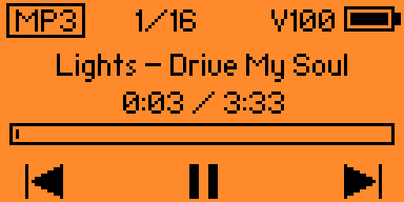
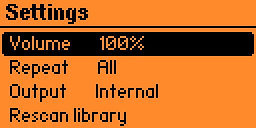
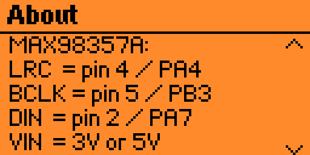

# MP3 Player for Flipper Zero

Current version: **v3.4**

Created by **Coolshrimp**.

A real MP3 player FAP for the Flipper Zero with three selectable outputs. Only one output runs at a time.

- **Internal** decodes MP3 to mono PCM and drives the built-in speaker with a custom 10-bit, 62.5 kHz PWM carrier at a 15.625 kHz sample rate.
- **MAX98357A** decodes the same MP3 stream and sends 15-bit mono I2S audio to a MAX98357A amplifier module at an exact 16 kHz. TIM2 generates the 512 kHz BCLK while DMA updates LRCLK and DIN before each rising edge.
- **PAM8403** generates a 500 kHz, 32x first-order pulse-density stream on pin 3/PA6 at a 15.625 kHz audio rate. Light dither suppresses tonal idle patterns during quiet passages, while the deliberately lightweight modulator leaves CPU time for smooth MP3 decoding and UI controls. An external RC low-pass filter converts this to the analog input required by the pictured PAM8403 board.

The app includes a main menu, song list, Now Playing controls, volume, repeat/output settings, and an About/pinout screen. The default library is `/ext/music` on the microSD card.

## Screenshots

| Main Menu | Song List | Now Playing |
|---|---|---|
|  |  |  |

| Settings | About |
|---|---|
|  |  |

## Internal vs External output

**Use the external MAX98357A module if you can.** Internal playback works, but it is not ideal:

- The Flipper's internal sounder is a piezo buzzer, not a music speaker. Expect buzzy, low-fidelity sound.
- It is **very quiet**, even at 100% volume. This is a hardware limitation of driving a piezo element from a GPIO PWM carrier, not something the app can fix. Internal-only compression already raises perceived loudness as far as the GPIO voltage range allows.

External output through a MAX98357A or properly filtered PAM8403 is dramatically louder than the internal sounder. **Volume control works on all outputs** because the app scales PCM samples before digital output generation. The PAM8403 chip itself has fixed gain; this pictured board has no volume potentiometer.

In PAM8403 mode, the displayed volume uses a custom curve because the board's fixed noise floor overwhelmed its quieter settings. `V0` is true mute, `V10` equals the old `V40`, `V50` equals the old `V70`, and `V100` remains full scale. Values between those points transition smoothly. Pause and stopped playback also produce silence. Internal and MAX98357A volume ranges are unchanged.

## MP3 compatibility

No desktop conversion is required. Copy ordinary `.mp3` files directly into `/ext/music`; the app reads the sample rate stored in each MP3 frame and converts it automatically for the selected output.

**Any MP3 bitrate plays** — 8 kbps through 320 kbps, CBR and VBR alike. The decoder reads the bitrate from each frame header, so mixed-bitrate and variable-bitrate files are handled without any special setup.

Supported standard Layer III input includes:

- All MPEG-1/2/2.5 Layer III bitrates, from 8 kbps to 320 kbps.
- Sample rates of 8, 11.025, 12, 16, 22.05, 24, 32, 44.1, and 48 kHz.
- Mono and stereo.
- CBR and VBR streams, CRC-protected frames, and free-format streams.
- ID3v2 metadata and large embedded album art, which are skipped without loading the artwork into RAM.

AAC, M4A, WMA, or FLAC data renamed to `.mp3`, DRM-protected content, and severely damaged files are not valid MP3 audio and will show an error.

## Controls

### Song List

| Key | Action |
|---|---|
| Up / Down | Move through the list |
| OK | Open Now Playing and start that song |
| Back | Return to the main menu |

### Now Playing

| Key | Action |
|---|---|
| Up / Down | Volume up / down |
| Left / Right (short press) | Previous / next song |
| Left / Right (hold) | Seek backward / forward in five-second steps |
| OK | Play / pause |
| Back | Return to the song list |

Seeking resumes only if the song was playing before the hold; a paused song stays paused. Track changes keep playing when the old track was playing and remain stopped when it was paused.

### Settings

- **Output** — select `Internal`, `MAX98357A`, or `PAM8403`.
- **Repeat** — `Repeat One` restarts the current track; `Repeat All` advances and continues at the end of a track.
- **Volume** — same level used by Now Playing.
- **Rescan library** — re-reads the folder named in `music_path.txt`.

## Configurable music folder

During launch, before any library scan, the app creates this editable text file on the SD card if it does not already exist:

```text
/ext/apps_data/mp3_player/music_path.txt
```

Its default contents are:

```text
/ext/music
```

Replace that single line with any folder below `/ext`, for example `/ext/Music/Albums`. Choose **Settings > Rescan library** after editing it; restarting the app is not required. Invalid paths safely fall back to `/ext/music`.

The scan begins only when Song List is first opened. It reads only MP3 files directly inside the directory named in `music_path.txt`; subfolders are ignored. It stops after five seconds, 1,024 directory entries, or 100 songs. Keeping the library flat substantially reduces RAM use and leaves enough memory for the decoder and audio backends.

Volume, repeat mode, and output selection are stored in the app's versioned settings file and restored on the next launch. Missing or damaged settings safely fall back to `50%`, `Repeat Off`, and `Internal`.

## Now Playing screen

Now Playing uses a compact portable-player layout with an `MP3` badge, current/total track number, live volume level (`V0`–`V100`), battery gauge, song title, elapsed/estimated total time, progress bar, and icon-only transport controls. Internal playback is automatically resampled to 15.625 kHz; this does not require changing the original file.

## MAX98357A wiring

| MAX98357A | Flipper Zero | MCU signal |
|---|---:|---|
| BCLK | pin 5 | PB3 |
| DIN | pin 2 | PA7 |
| LRC / LRCLK | pin 4 | PA4 |
| VIN | pin 1 | +5 V |
| GND | any GND pin | GND |
| Speaker + / - | external speaker | Do not connect either speaker lead to ground |

When USB is connected, pin 1 already receives USB 5 V. During battery operation, the app enables the Flipper's 5 V OTG rail while external playback is active and disables it afterward only if the app enabled it. Connect the module while the Flipper is powered off. The GPIO signals remain 3.3 V logic even though the amplifier is powered from 5 V.

The MAX98357A does not need MCLK or I2C configuration. Its `SD` and `GAIN` breakout settings can be left at the board defaults; change them only if you need channel/gain selection.

## PAM8403 wiring

The pictured 21 x 18 mm board exposes `5V +/−`, analog inputs `R/GND/L`, and four bridge speaker outputs. It does not accept I2S or raw unfiltered PWM.

Flipper Zero pinout for this output:

| Flipper Zero | MCU signal | Purpose |
|---|---:|---|
| pin 3 | PA6 | 500 kHz pulse-density audio output; feeds the RC filter below |
| pin 1 | +5 V | PAM8403 `5V +` |
| any GND pin | GND | PAM8403 `5V −` and input GND |

Pin 3 carries the raw pulse-density stream and must never be wired straight to the PAM8403 input — the RC filter shown below is required to convert it to the analog signal the board expects.

Board-side connections:

| PAM8403 board | Connection |
|---|---|
| `5V +` | Flipper pin 1 / 5 V |
| `5V −` | Flipper GND |
| `R` input | Filtered mono signal through its own 1 kΩ resistor |
| Input GND | Flipper GND |
| `L` input | Filtered mono signal through its own 1 kΩ resistor |
| `R− / R+` | Right speaker only |
| `L− / L+` | Left speaker only |

Required PDM filter:

```text
Flipper pin 3 / PA6
        |
       2.2 kΩ
        +---- 10 nF ---- GND
        |
       2.2 kΩ
        +---- 10 nF ---- GND
        |
        +---- 1 kΩ ---- PAM R input
        |
        +---- 1 kΩ ---- PAM L input
```

The pictured board already appears to include input coupling capacitors. If a different PAM8403 board does not, add a 1 µF series coupling capacitor after the filter, with the positive side toward PA6. Never connect either speaker output terminal to ground, never join the left and right speaker outputs, and never feed the PAM8403 speaker outputs into another audio input.

Pin 1 can power light/moderate testing. Full stereo power into 4 Ω speakers can require more current than the Flipper should supply; use a separate regulated 5 V amplifier supply for high output, join its ground to Flipper GND, and do not connect that supply back into Flipper pin 1.

## Build

```sh
ufbt
```

The resulting package is `dist/mp3_player.fap`.

## Decoder

The project vendors [minimp3](https://github.com/lieff/minimp3) under its CC0 license; see `MINIMP3_LICENSE`.

## Practical limitations

- Internal output is quiet and buzzy by nature; MAX98357A or PAM8403 with the required filter is recommended. See [Internal vs External output](#internal-vs-external-output).
- Folder recursion is intentionally disabled. Put MP3 files directly in the directory selected by `music_path.txt`.
- The decoder uses an 8 KB compressed-data window and a 24 KB thread stack to fit alongside a 100-song filename index.
- Output is mono and converted with a weighted anti-alias resampler: 15.625 kHz for Internal/PAM8403 or an exact 16 kHz for MAX98357A.
- Playback prebuffers 512 samples and cleanly re-primes after a decoder underrun.
- MP3 decoding is CPU- and memory-intensive on the STM32WB55. Very high bitrate or unusual files may underrun.
- MAX98357A timing is synthesized from TIM2 and DMA1 channel 3 using PB3/PA7/PA4. PAM8403 reuses TIM2 and DMA1 channel 3 for 500 kHz pulse-density output on PA6, so only the selected backend occupies those resources. Native 44.1/48 kHz remains future SAI work.

## License

Released under the MIT License; see `LICENSE`.
